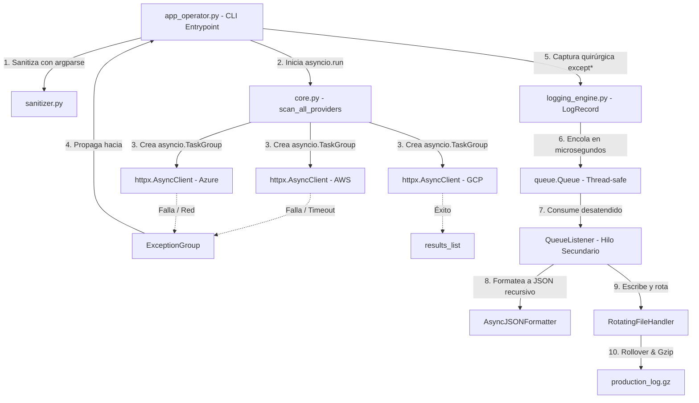

# Proyecto Tritón

Sistema de Telemetría Multicloud y Observabilidad Asíncrona

### Características

- Consulta estados de los clústeres en tiempo real.
- Muestreo de datos legible para el humano.
- Ejecución asíncrona mediante asyncio.

### Tecnologías

- Python
- pip
- asyncio

### Requisitos

- Python 3.11 o superior

## Instalación

1.  Clonar el repositorio

    1. Ve a la carpeta donde quieres guardar el proyecto:
        
        ```bash
        cd ruta/de/la/carpeta
        ```
    2. Clona el repositorio:
        
        ```bash
        git clone git@github.com:leoventicola/TP1-Triton-project.git
        ```
    3. Entra al proyecto:
        
        ```bash
        cd TP1-Triton-project
        ```

2. Instalar dependencias
    
    1. Crear el entorno virtual

        Dentro de la carpeta del proyecto:
        
        - Windows:

          ```bash
          python -m venv .venv
          ```
        
        - Linux / macOS:

          ```bash
          python3 -m venv .venv
          ```
        
        Esto crea una carpeta llamada `.venv`.
    
    2. Activarlo

        - Windows (CMD):
        
          ```bash
          .venv\Scripts\activate
          ```

        - Windows (PowerShell):

          ```bash
          .\.venv\Scripts\Activate.ps1
          ```

        - Linux / macOS:
            
          ```bash
          source .venv/bin/activate
          ```
        
          Cuando esté activado, normalmente verás algo como:

            ```bash
            (.venv) $
            ```

    3. Instalar paquetes:
    
        Con el entorno activado:

          ```bash
          pip install -r requirements.txt
          ```

[# Cómo Usar]:#

---

## Calidad y pruebas

El proyecto cuenta con pruebas automatizadas y herramientas de análisis estático
(Flake8 y Pylint) para verificar su correcto funcionamiento y mantener la
calidad del código.

Para conocer cómo ejecutar las pruebas y las herramientas de análisis,
consultar [CONTRIBUTING.md](CONTRIBUTING.md).

---

##  Diagrama de Arquitectura de Telemetría
El siguiente flujo conceptual ilustra cómo interactúan las corrutinas asíncronas de telemetría, el agrupamiento de excepciones concurrentes, la cola segura en memoria y el formateador recursivo JSON para persistir los volcados comprimidos:



# Equipo de desarrollo

#### Equipo 404

- Integrante 1: [@Cointte, Mateo](https://github.com/Th-30Mateo)
- Integrante 2: [@Mamaní, Cristian](https://www.github.com/mamanicristian92)
- Integrante 3: [@Choque, Ismael](https://www.github.com/ismahack7)
- Integrante 4: [@Venticola, Leandro](https://github.com/leoventicola/)
- Integrante 5: [@Martinez, Gustavo](https://www.github.com/)
- Integrante 6: [@Lescano, Jessica](https://www.github.com/daylagitana89jl-oss)